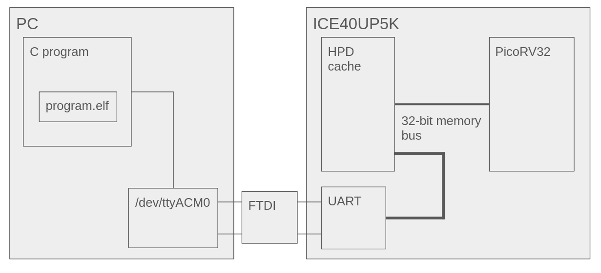

---
header-includes:
 - \usepackage{fvextra}
 - \usepackage{graphicx}
 - \DefineVerbatimEnvironment{Highlighting}{Verbatim}{breaklines,commandchars=\\\{\}}
 - \usepackage[letterpaper, margin=1in]{geometry}
 - \usepackage{hyperref}
 - \hypersetup{colorlinks=true,urlcolor=blue,allbordercolors={0 0 0},pdfborderstyle={/S/U/W 1}}
link-citations: true
---

# Final Report
Lennan Tuffy, Aditya Bedekar

[Git Repo](https://github.com/adityabedekar17/risc-v-uart)

The commit `fd51a13` shows the best working version of the project.

## Project overview
The project was to integrate a program running on a computer that fulfills memory requests sent over uart, from the fpga that has a RISC-V core along with an LRU cache.



## PicoRV32
The PicoRV is a 32 bit RISC-V core.
We chose to use the smallest `rv32i` version over the multiplier or axi versions.

## HPDCache
HPDCache is a highly configurable, high-performance, multi-requester, out-of-order L1 Dcache for RISC-V cores and accelerators.
We chose to use this since it was used with the `cva6` project, another open RISC-V core.

## Connecting the core with the cache

MSHR (Miss Status Handling Registers) configured for pipeline stages:

 - 4 MSHR sets (one per pipeline stage)
 - 2 MSHR ways for concurrent misses

Purpose: MSHRs track outstanding cache misses to avoid blocking new memory accesses.
Eg:

1) CPU requests data at address 0X1000, cache miss
2) MSHR store its request, while allowing CPU to continue
3) If another request 0x1004 hits same cache line, MSHR can merge it into the same transaction. In our configuration there are 4 MSHR sets, and 2 MSHR ways which allows for two concurrent cache misses.

Write buffer: 8 directory entries, 4 data entries, holds write operations before they are sent to main memory.
8 directory entries (to track where data goes), 4 data entities (to temporarily store data before writing).
Write-back policy for better performance.

Transaction ID width: 4 bits (16 outstanding transactions), used to identify memory requests.

PMA: An underlying system can have multiple physical memory attributes (PMA)

Cacheability: For a memory space that is segmented (where segment is defined from base address to end address) some segments are cacheable. 
HPDCache needs to know which segments are cacheable.
Request interface implements an uncacheable bit, when bit is set to 1 , the access is uncacheable. 

- Eg: For uncacheable memory, consider I/O device register like a UART serial port, to ensure the latest value is read from hardware.
- Eg: for a given read request, should read data be copied into the cache

For the cache memory interface (CMI) , these are a few types of memory request operation types that are supported

## `serialram`
I made the program `serialram` to act as if it was a regular memory for the PicoRV or the cache to make requests to.
It uses `libserialport` to interact with the FPGA over uart.
Since the uart was not working initially, I made a python version that does the same thing.
Running serialram would show unexpected behaviour (freezes after the 16th write), so to run it properly, I needed to run the pyhton version before it, for every time the FPGA was plugged into the pc.
The first iteration used instructions that were compiled to the code (set in a static `uint32_t` array), then I moved onto reading from an `.elf` file.
The stack section of the program is also represented as an `uint32_t` array, with 32kB worth of space.
The program ends when an `ebreak` instruction is read.

### Writing to the memory
```c
size_t addr_off = addr >> 2;
addr_off -= STACK_OFF;

if (addr > MEM_SIZE) {
  if (addr == 0x10000000) {
    putchar(data & 0xff);
  }
}
else {
  memory[addr_off] = 0;
  if (recv_buf[0] & 0x01){
    memory[addr_off] |= (data & 0x000000ff);
  }
  if (recv_buf[0] & 0x02){
    memory[addr_off] |= (data & 0x0000ff00);
  }
  if (recv_buf[0] & 0x04){
    memory[addr_off] |= (data & 0x00ff0000);
  }
  if (recv_buf[0] & 0x08){
    memory[addr_off] |= (data & 0xff000000);
  }
}

```

### Reading from the memory
```c
if (addr > 0x00018000) {
  // within stack mem
  size_t addr_off = addr >> 2;
  addr_off -= STACK_OFF;

  data = memory[addr_off];
}
else {
  // within instr mem
  data = get_word_addr(addr >> 2);
  if (data == 0x00100073){
    printf("Received ebreak instr\n");
    break;
  }
}
```


## Compiling the `.elf` file
Getting the `riscv-gnu-toolchain` cloned took some workarounds, since the submodules pointed to dead links.
Then, the build instructions in the picorv readme didn't work as expected, so I used the instructions in the toolchain's readme.
Once that was compiled, it was pretty simple to compile the firmware source files into an elf file.
All it took was to set the correct architecture and linking flags.

## The firmware files
The assembly file `start.S` sets all registers to 0, then jumps to the main code at the `count` or `sort` symbol.
These symbols are defined in `firmware.c`, which count from 0 to 255, and insertion sorts an array respectively.

```
addi x30, zero, 0
addi x31, zero, 0

/* set stack pointer */
lui sp,(128*1024)>>12

/* call count C code */
jal ra,sort

/* trap */
ebreak
```

## Memory mapped I/O
`serialram` interprets writes to the address `0x1000000` as being a memory mapped I/O, where it should print to the console on the computer running it.
Since the memory allocated for the stack only goes to 128kB, any address bigger than that is invalid, unless specified, like the print.

### The putc function
```c
#define OUTPORT 0x10000000

void putc(char ch){
  *((volatile uint32_t*)OUTPORT) = ch;
}
```

### The print_hex function
```c
char digit_to_char(uint8_t digit){
  char out;
  switch (digit) {
    case 0x0: out = '0'; break;
    case 0x1: out = '1'; break;
    case 0x2: out = '2'; break;
    case 0x3: out = '3'; break;

    case 0x4: out = '4'; break;
    case 0x5: out = '5'; break;
    case 0x6: out = '6'; break;
    case 0x7: out = '7'; break;

    case 0x8: out = '8'; break;
    case 0x9: out = '9'; break;
    case 0xa: out = 'a'; break;
    case 0xb: out = 'b'; break;

    case 0xc: out = 'c'; break;
    case 0xd: out = 'd'; break;
    case 0xe: out = 'e'; break;
    case 0xf: out = 'f'; break;
    default: out = 0;
  }
  return out;
}

void print_hex(unsigned int num, int digits){
  putc('0');
  putc('x');
  for (int i = (4*digits)-4; i >= 0; i -= 4){
    unsigned int mask = 0xf << i;
    char digit = digit_to_char((num & mask) >> i);
    putc(digit);
  }
}
```

## Reading the `.elf` file
The file `elf_read.c` defines the functions needed to read from an `.elf` file as easily as possible for the caller.
The caller must initialize the static array of instructions, then make any request at the valid addresses.
Once finished, the caller can free the memory and exit.
These functions were used in both DPI-C for verilator, and `serialram`'s main loop.

```c
static uint32_t *elf_program;

void load_elf(const char *path){
  FILE *elf_file = fopen(path, "rb");
  if (elf_file == NULL){
    printf("Failed reading elf file\n");
    exit(EXIT_FAILURE);
  }

  Elf32_Ehdr elf_head;
  Elf32_Phdr elf_phead;

  fread(&elf_head, sizeof(elf_head), 1, elf_file);

  fseek(elf_file, elf_head.e_phoff, 0);
  fread(&elf_phead, sizeof(elf_phead), 1, elf_file);

  Elf32_Off elf_program_offset = elf_phead.p_offset;
  uint32_t elf_program_size = elf_phead.p_memsz;

  elf_program = (uint32_t *) calloc(sizeof(uint32_t), elf_program_size);
  fseek(elf_file, elf_program_offset, 0);
  fread(elf_program, sizeof(uint32_t), elf_program_size, elf_file);
  fclose(elf_file);
}

uint32_t get_word_addr(uint32_t word_addr){
  return *(elf_program + word_addr);
}
```

## What did we learn?

- ELF: writing firmware with riscv-gnu-toolchain without the usual stdlib or anything that commonly comes with embedded systems
- Verilator: DPI-C with elf.h - sharing the same code for the testbench and serialram
- SystemVerilog language features: structs, sv header files, macros for typedefs
- Integrating an open-source cache with another open-source RISC-V core

The hpdcache ended up not working in our project. 
`sv2v` worked fine with converting all of the source files into verilog, but the output seemed to contain several assertions that would always compute to 1, making `yosys` fail.
Also, linting and simulating with `verilator` didn't work either as something was causing the linter to get stuck.
Further studying the documentation of the HPDCache, as well as having a much better understanding of general ache architectures would have helped resolve these issues, as they seem to stem from incorrectly set config variables.
